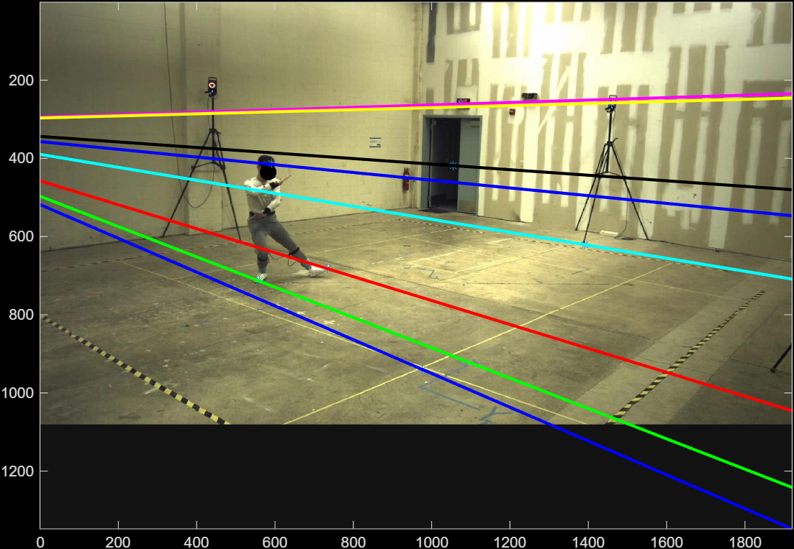
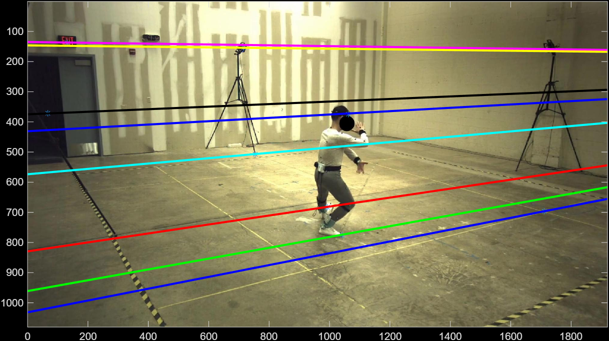
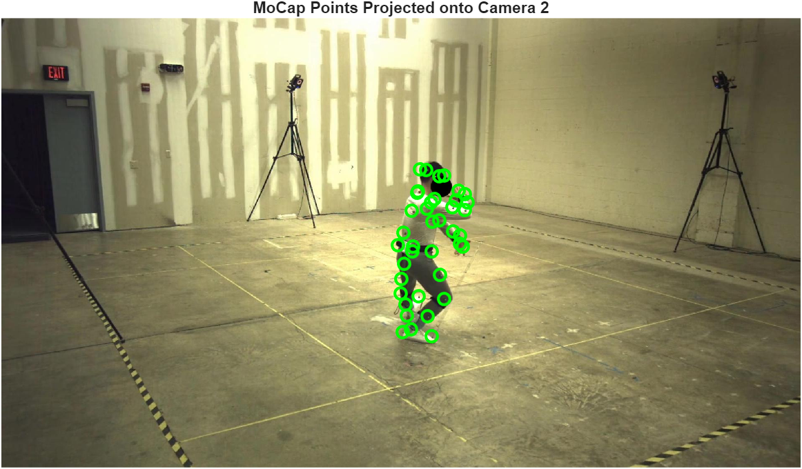
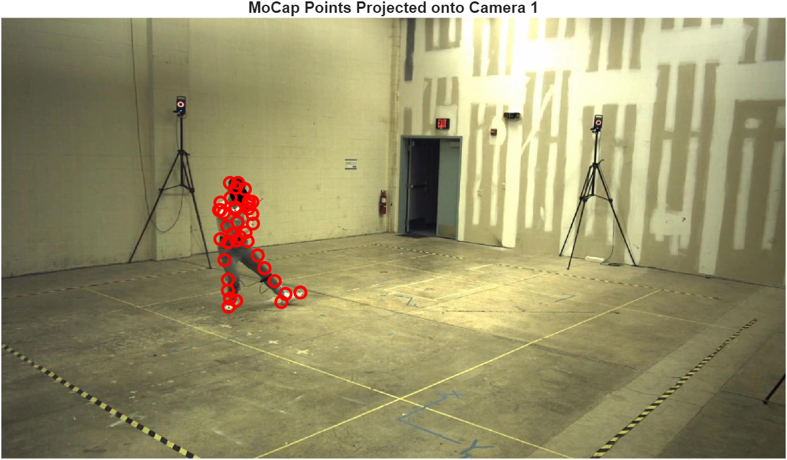
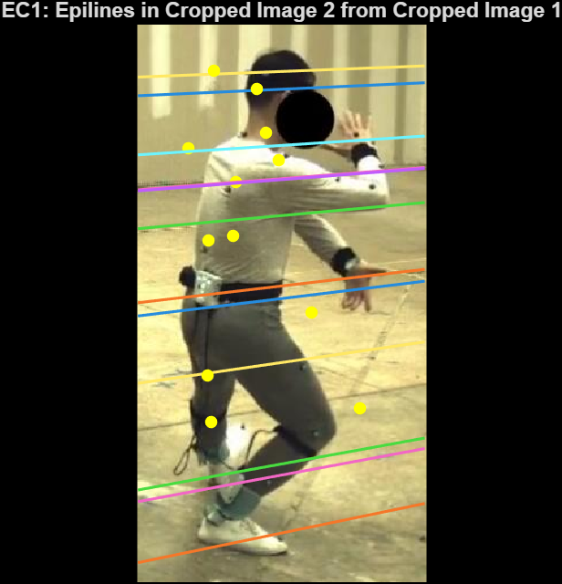
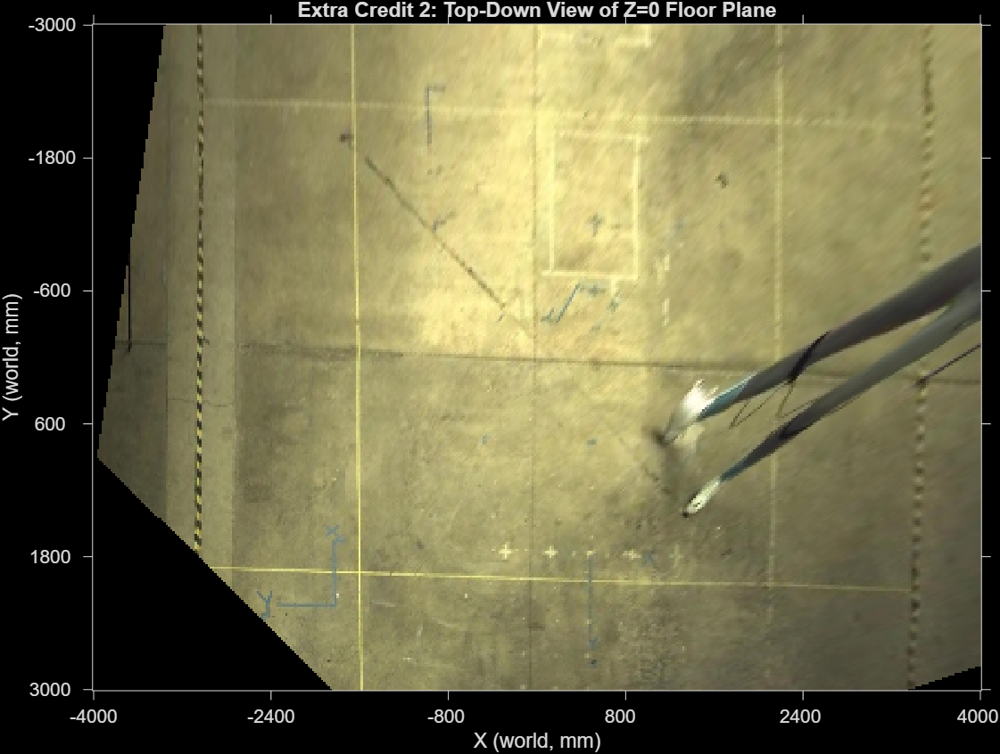

# Epipolar Geometry & 3D Triangulation

**EE 454 — Computer Vision | Group Project 2**

This project implements a complete stereo-vision pipeline for recovering the 3D geometry of a scene from two calibrated camera views. Given a pair of rectified images and known camera parameters, the system estimates the epipolar geometry between the cameras (encoded as the Fundamental matrix **F**), triangulates 2D point correspondences into 3D world coordinates, and makes quantitative scene measurements such as object heights and plane equations. The pipeline covers two routes to **F**: a closed-form computation from calibration data (via the Essential matrix) and a data-driven normalized eight-point algorithm using manually selected point correspondences.

---

## Techniques Implemented

### Epipolar Geometry

For two cameras viewing the same scene, every 3D point lies on an epipolar line in each image. The **Fundamental matrix F** (3×3, rank 2) encodes this constraint: for any pair of corresponding image points **x₁** and **x₂**, the relationship **x₂ᵀ F x₁ = 0** must hold. This project computes F two ways and evaluates them against each other.

### Calibration-Based F (Task 3.5)

When the intrinsic and extrinsic camera parameters are known, F can be derived analytically. `task3_5.m` computes the relative rotation **R = R₂R₁ᵀ** and translation **t = R₂(C₁ − C₂)**, assembles the Essential matrix **E = [t]× R** using the skew-symmetric cross-product matrix, and then recovers the Fundamental matrix as **F = K₂⁻ᵀ E K₁⁻¹**. Rank-2 is enforced by zeroing the smallest singular value via SVD.

### Normalized Eight-Point Algorithm (Tasks 3.6, `eightpoint.m`)

`eightpoint.m` implements the normalized (Hartley-conditioned) eight-point algorithm. The algorithm:

1. **Normalizes** each point set by subtracting the centroid and scaling so the average distance from the origin is roughly √2 (Hartley preconditioning via transformation matrices **T₁**, **T₂**).
2. **Builds the design matrix A**, where each row encodes one correspondence as `[x₁x₂  x₁y₂  x₁  y₁x₂  y₁y₂  y₁  x₂  y₂  1]`.
3. **Solves** for the vectorized F as the eigenvector of **AᵀA** corresponding to the smallest eigenvalue.
4. **Enforces rank 2** by zeroing the smallest singular value of F.
5. **Denormalizes** by applying **F ← T₂ᵀ F T₁**.
6. **Visualizes** the resulting epipolar lines overlaid on both images.

### Triangulation (`triangulatePoint.m`, Tasks 3.3–3.4)

`triangulatePoint.m` reconstructs a 3D point from two image observations. For each camera, the 2D pixel coordinate is back-projected to a 3D viewing ray using the inverse intrinsic matrix and rotation: **v_world = R⁻¹ K⁻¹ x** (normalized). The two rays from camera centers C₁ and C₂ do not intersect exactly in the presence of noise, so the midpoint of the shortest segment between them is returned as the 3D estimate. This is solved by setting up a 2×2 linear system in the ray parameters **t** and **s** and taking the midpoint of **P₁ = C₁ + t·v₁** and **P₂ = C₂ + s·v₂**.

### 3D Point Projection (`project_points_function.m`, Task 3.2)

`project_points_function.m` projects known 3D mocap points into each camera's image plane. It computes the full 3×4 projection matrix **P = K [R | t]** and maps each homogeneous world point to pixel coordinates via perspective division.

### Symmetric Epipolar Distance (Task 3.7)

`task3_7.m` evaluates the quality of both F matrices by computing the **Symmetric Epipolar Distance (SED)** — the mean of the squared point-to-epipolar-line distances in both directions — over the 39 known point correspondences.

---

## Project Structure

| File | Task | Description |
|------|------|-------------|
| `task3_1.m` | 3.1 | Verify camera Pmat from R, t, and position parameters |
| `task3_2.m` | 3.2 | Project 3D mocap points onto both camera images |
| `task3_3.m` | 3.3 | Triangulate all 39 mocap points; compute MSE vs. ground truth |
| `task3_4.m` | 3.4 | Interactive triangulation to measure scene geometry (floor plane, wall plane, doorway height, person height) |
| `task3_5.m` | 3.5 | Compute F analytically from calibration (Essential matrix route) |
| `task3_6.m` | 3.6 | Compute F from clicked point correspondences using `eightpoint.m` |
| `task3_7.m` | 3.7 | Compare both F matrices via Symmetric Epipolar Distance |
| `eightpoint.m` | 3.6 | Normalized eight-point algorithm with epipolar-line visualization |
| `triangulatePoint.m` | 3.3–3.4 | Helper: triangulate a single 3D point from two 2D observations |
| `project_points_function.m` | 3.2 | Helper: project 3D points through a calibrated camera |
| `extra1_crop_and_F.m` | EC 1 | Compute updated F′ for a cropped/scaled sub-image region |
| `extra_credit_2.m` | EC 2 | Generate a top-down (bird's-eye) view of the Z=0 floor plane via homography |
| `EE_454_Testbenching_Project_2.m` | — | Team testbench script (Emperor-Penguin-3) |

**Data files:** `Parameters_V1_1.mat`, `Parameters_V2_1.mat` (camera intrinsics/extrinsics), `mocapPoints3D.mat` (39 ground-truth 3D points), `mocapPoints2D_cam_{1,2}.mat` (projected 2D correspondences), `im1corrected.jpg`, `im2corrected.jpg` (stereo image pair).

---

## Results

### Eight-Point Algorithm — Epipolar Lines on Both Views

The epipolar lines computed from manually selected correspondences pass accurately through the matching feature points in both images, confirming that the estimated F has low reprojection error.

*Figure 1: Epipolar lines overlaid on Image 1. Each colored line corresponds to a point selected in Image 2.*

*Figure 2: Epipolar lines overlaid on Image 2. Each colored line corresponds to a point selected in Image 1.*

### Task 3.2 — Projected MoCap Points

The 39 motion-capture markers are projected onto each camera image, verifying that the calibrated projection matrices are correct.

*Figure 3: 39 mocap markers projected onto Camera 1 (yellow crosses).*

*Figure 4: Same 39 markers projected onto Camera 2.*

### Extra Credit 1 — Epipolar Lines in Cropped Sub-Images

*Figure 5 (EC1): Epipolar lines drawn in the cropped region around the subject in Camera 1, using the updated F′ derived from the crop homography.*

### Extra Credit 2 — Top-Down Floor View

*Figure 6 (EC2): Bird's-eye (Z = 0) view generated via a planar homography computed from the calibration projection matrix of Camera 1. Structures on the floor (walls, the subject's footprint) appear correctly; objects above the floor are distorted, as expected.*

---

## Team

| Contributor | GitHub | Role |
|-------------|--------|------|
| Het Sheth | [@het-sheth](https://github.com/het-sheth) | Core pipeline: `eightpoint.m` (eight-point algorithm), `triangulatePoint.m` (triangulation), `project_points_function.m` (point projection), Tasks 3.1–3.4, Extra Credit 2 |
| Akshit Kartik | [@AKAAKS](https://github.com/AKAAKS) | Task 3.5 (calibration-based F), Extra Credit 1 (crop-and-F update) |
| Tyler Cheng | [@Tylerqche](https://github.com/Tylerqche) | Tasks 3.6–3.7 (eight-point demo, SED comparison) |
| Emperor-Penguin-3 | [@Emperor-Penguin-3](https://github.com/Emperor-Penguin-3) | Tasks 3.1/3.2 development, team testbench script |

---

## Tech Stack

- **Language:** MATLAB
- **Data:** Pre-collected stereo image pair and motion-capture ground-truth 3D points (provided with the assignment)
